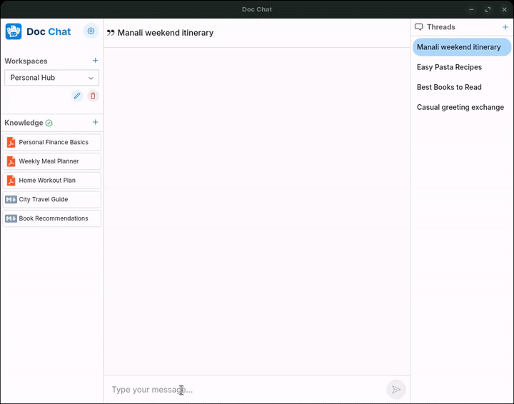

**Your documents. Your questions. AI-powered answers.**

[](https://github.com/cod3rboy/docchat/releases)


DocChat is a fast, lightweight desktop app that lets you **chat with your documents, uncover insights, and find answers instantly**—without digging through endless pages.

Built with **Go, Wails, React, and TypeScript**.



## ✨ Features

|     |                               |                                                                                  |
| --- | ----------------------------- | -------------------------------------------------------------------------------- |
| 🤖  | **AI Document Chat**          | Ask questions and get contextual answers from your documents.                    |
| 📚  | **Multi-Document Support**    | Build a searchable knowledge base from multiple documents.                       |
| 🔍  | **Semantic Search**           | Find relevant information by meaning, not just keywords.                         |
| 💬  | **Conversational AI**         | Ask follow-up questions while maintaining conversation context.                  |
| 🎨  | **Simple & Clean UI**         | Enjoy a minimal, intuitive interface designed for a distraction-free experience. |
| 🌓  | **Dark & Light Themes**       | Choose an eye-friendly dark or light theme to match your preference.             |
| 🎨  | **Customizable Accent Color** | Personalize the app with an accent color that suits your style.                  |
| 🔒  | **Privacy Focused**           | Keep your documents and knowledge under your control.                            |
| ⚡  | **Lightweight Desktop App**   | A fast, native desktop experience without a browser.                             |
| 🛠️  | **Open Source**               | Inspect, customize, and contribute to the project.                               |

## 📦 Installation

**Supported platforms**

| Operating System | Architecture |
| ---------------- | ------------ |
| 🐧 Linux         | amd64        |
| 🪟 Windows       | amd64        |

### Linux

Download your preferred package from **[Releases](https://github.com/cod3rboy/docchat/releases)**:

- **AppImage**

  ```bash
  chmod +x DocChat-*.AppImage
  ./DocChat-*.AppImage
  ```

- **Debian / Ubuntu**

  ```bash
  sudo apt install ./DocChat-*.deb
  ```

- **Fedora / RHEL**

  ```bash
  sudo dnf install ./DocChat-*.rpm
  ```

### Windows

Download the latest `DocChat-*-windows-amd64.exe` portable executable from **[Releases](https://github.com/cod3rboy/docchat/releases)** and run it.
That's it! No installation required.

## 🛠️ Development

Prerequisites

- Install [Go](https://go.dev/)
- Install [Node.js](https://nodejs.org/)

### Clone the Repository

```bash
git clone https://github.com/cod3rboy/docchat.git
cd docchat
```

### Install tools

```bash
make install-tools
```

### Run in Development Mode

Start the Wails development server:

```bash
wails dev -tags=webkit2_41
```
